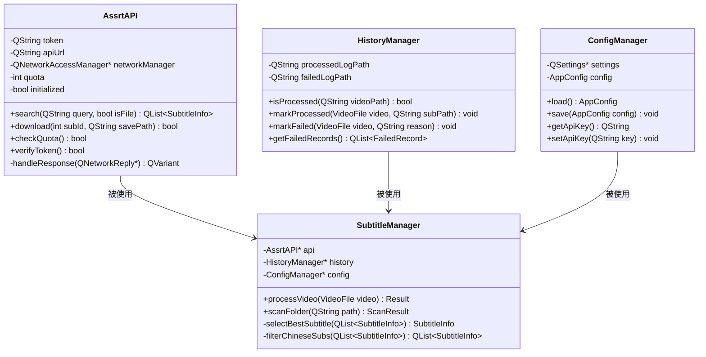
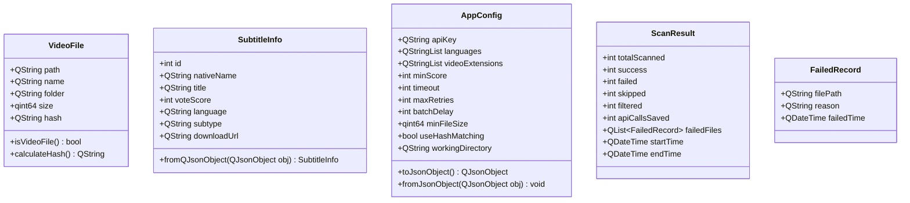
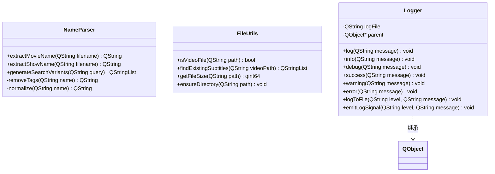
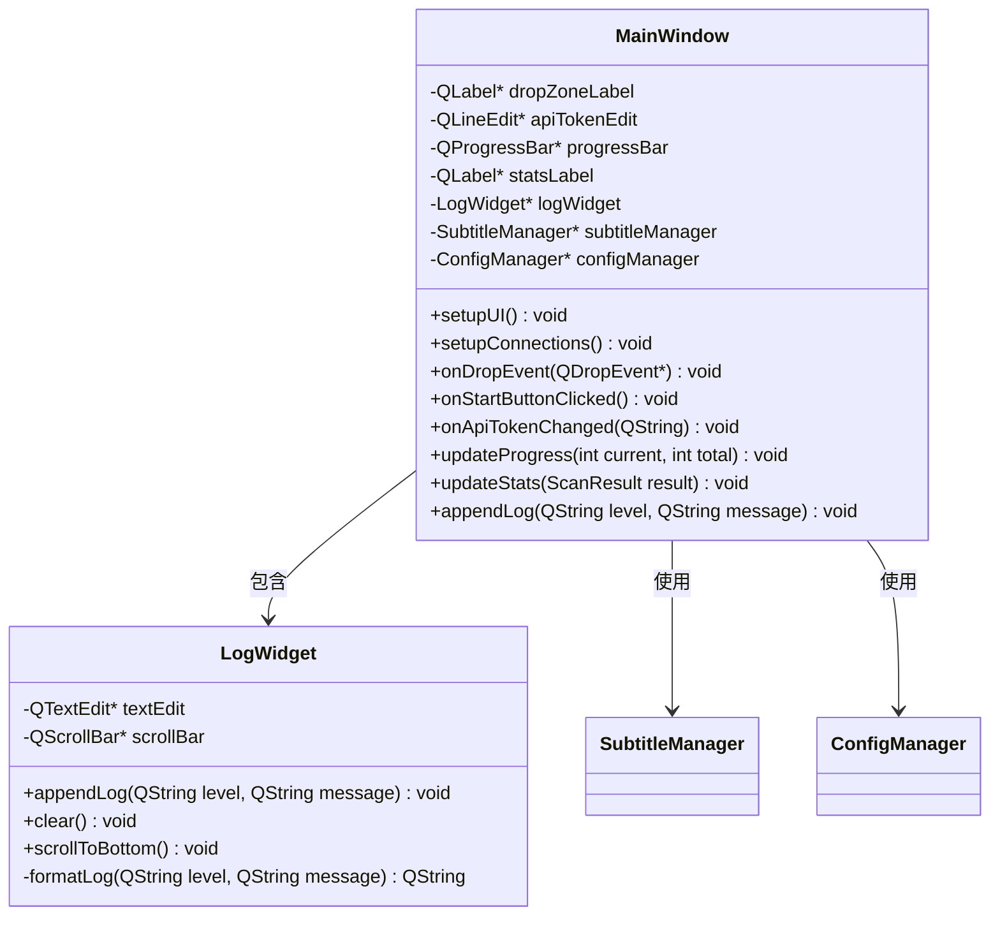
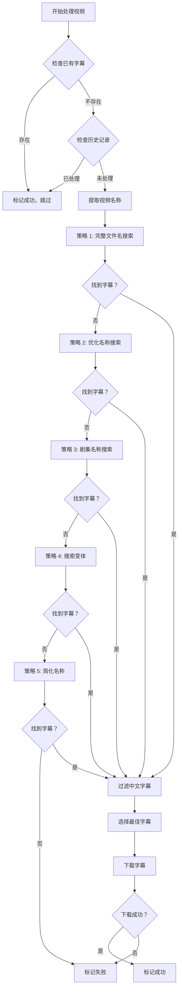
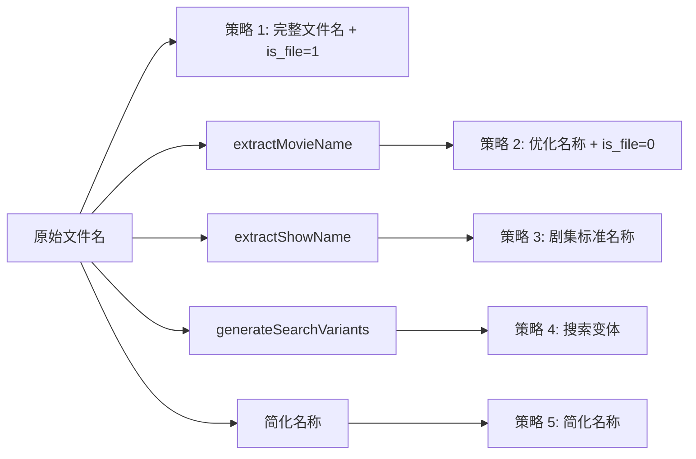
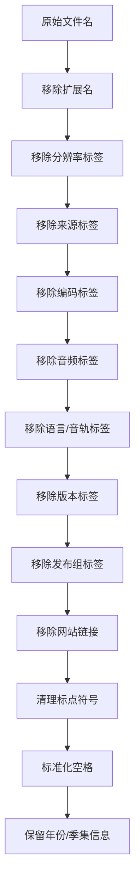
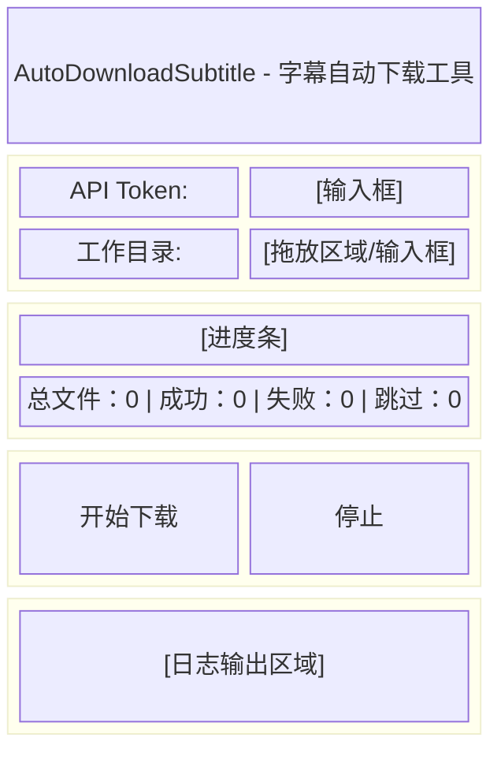
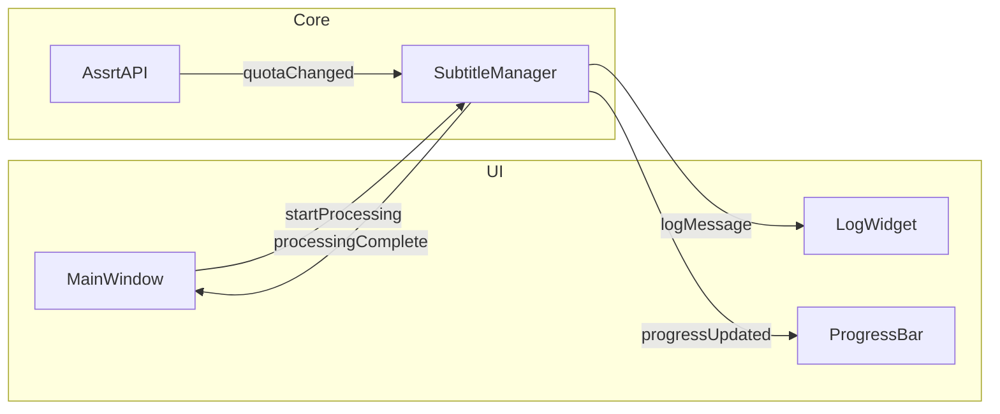

# AutoDownloadSubtitle Windows 桌面应用 - 架构设计文档

## 1. 技术选型

| 项目 | 选择 | 说明 |
|------|------|------|
| 语言 | C++17 | 现代 C++ 特性，更好的类型安全 |
| UI 框架 | Qt 5.15+ | 跨平台 GUI 框架，Windows 原生外观 |
| 构建系统 | CMake 3.16+ | 现代化构建配置 |
| HTTP 客户端 | Qt Network (QNetworkAccessManager) | Qt 内置，无需额外依赖 |
| JSON 解析 | Qt JSON (QJsonDocument) | Qt 内置 |
| 配置文件 | QSettings + JSON | 注册表/INI 文件 + JSON 日志 |
| 安装包 | Inno Setup | Windows 主流安装工具 |

## 2. 项目结构

```
Windows/
├── CMakeLists.txt                 # 主 CMake 配置
├── README.md                      # 项目说明
├── src/
│   ├── main.cpp                   # 程序入口
│   ├── core/                      # 核心业务逻辑
│   │   ├── AssrtAPI.h/.cpp        # API 客户端
│   │   ├── SubtitleManager.h/.cpp # 字幕管理
│   │   ├── HistoryManager.h/.cpp  # 历史记录管理
│   │   └── ConfigManager.h/.cpp   # 配置管理
│   ├── models/                    # 数据模型
│   │   ├── VideoFile.h            # 视频文件模型
│   │   ├── SubtitleInfo.h         # 字幕信息模型
│   │   └── AppConfig.h            # 应用配置模型
│   ├── utils/                     # 工具函数
│   │   ├── NameParser.h/.cpp      # 名称提取工具
│   │   ├── FileUtils.h/.cpp       # 文件工具
│   │   └── Logger.h/.cpp          # 日志工具
│   └── ui/                        # 用户界面
│       ├── MainWindow.h/.cpp      # 主窗口
│       ├── MainWindow.ui          # UI 布局
│       └── LogWidget.h/.cpp       # 日志显示控件
├── resources/                     # 资源文件
│   ├── app.qrc                    # Qt 资源文件
│   ├── icon.ico                   # 应用图标
│   └── styles.qss                 # 样式表
├── installer/                     # 安装包配置
│   └── setup.iss                  # Inno Setup 脚本
└── plans/                         # 设计文档
    └── architecture.md            # 本文件
```

## 3. 模块设计

### 3.1 核心模块 (core)



### 3.2 数据模型 (models)



### 3.3 工具模块 (utils)



### 3.4 用户界面 (ui)



## 4. 核心功能流程

### 4.1 字幕下载流程



### 4.2 多策略搜索详情



### 4.3 名称提取规则



## 5. 配置文件设计

### 5.1 应用配置 (QSettings/注册表)

```
HKEY_CURRENT_USER\Software\AutoDownloadSubtitle
├── ApiKey          : QString    # API Token
├── WorkingDirectory: QString    # 工作目录
├── WindowGeometry  : QByteArray # 窗口位置
├── WindowState     : QByteArray # 窗口状态
└── UseHashMatching : bool       # 是否使用哈希匹配
```

### 5.2 历史记录 (JSON)

```json
{
  "processed": {
    "video_hash_or_name": {
      "video_path": "C:\\Videos\\movie.mp4",
      "subtitle_path": "C:\\Videos\\movie.zh-CN.srt",
      "processed_time": "2024-01-01T12:00:00"
    }
  },
  "failed": [
    {
      "video_path": "C:\\Videos\\fail.mp4",
      "reason": "未找到字幕",
      "failed_time": "2024-01-01T12:05:00"
    }
  ]
}
```

## 6. 界面设计

### 6.1 主界面布局



### 6.2 日志级别样式

| 级别 | 图标 | 颜色 |
|------|------|------|
| INFO | ℹ️ | 黑色 |
| SUCCESS | ✅ | 绿色 |
| WARNING | ⚠️ | 橙色 |
| ERROR | ❌ | 红色 |
| DEBUG | 🔍 | 灰色 |

## 7. 打包发布

### 7.1 Inno Setup 脚本结构

```iss
[Setup]
AppName=AutoDownloadSubtitle
AppVersion=1.0.0
DefaultDirName={pf}\AutoDownloadSubtitle
DefaultGroupName=AutoDownloadSubtitle
OutputDir=Output
OutputBaseFilename=AutoDownloadSubtitle_Setup

[Files]
Source: "release\AutoDownloadSubtitle.exe"; DestDir: "{app}"
Source: "release\*.dll"; DestDir: "{app}"
Source: "release\platforms\*"; DestDir: "{app}\platforms"
Source: "release\styles\*"; DestDir: "{app}\styles"

[Icons]
Name: "{group}\AutoDownloadSubtitle"; Filename: "{app}\AutoDownloadSubtitle.exe"
Name: "{autodesktop}\AutoDownloadSubtitle"; Filename: "{app}\AutoDownloadSubtitle.exe"
```

### 7.2 CMake 发布配置

```cmake
# 设置发布类型
set(CMAKE_BUILD_TYPE Release)

# 包含 Qt 部署工具
include(BundleUtilities)

# 复制 Qt 运行时
add_custom_command(TARGET AutoDownloadSubtitle POST_BUILD
    COMMAND windeployqt $<TARGET_FILE:AutoDownloadSubtitle>
)
```

## 8. 信号槽设计



## 9. 错误处理策略

| 错误类型 | HTTP 状态码 | 处理策略 |
|----------|-------------|----------|
| 配额用尽 | 30900 (API) | 等待 60 秒重试 |
| 下载配额不足 | 493 (连续 2 次) | 等待 120 秒重试 |
| 服务器错误 | 429, 500, 502, 503, 504 | 等待 60 秒重试 |
| 非重试错误 | 400, 401, 403, 404 | 直接失败，记录日志 |
| 网络超时 | Timeout | 重试 2 次后失败 |

## 10. 性能优化

1. **快速模式**: 使用文件名匹配而非哈希计算，大幅提升处理速度
2. **批量处理**: 支持配置文件间延迟，避免 API 配额超限
3. **缓存机制**: 已处理记录缓存到内存，避免重复读取 JSON
4. **异步处理**: 使用 Qt 的异步网络请求，避免界面卡顿
5. **线程池**: 使用 QThreadPool 处理耗时操作

## 11. 待办事项

- [ ] 1. 设计项目结构和模块架构
- [ ] 2. 创建 CMake 构建配置
- [ ] 3. 实现核心数据模型类
- [ ] 4. 实现 API 客户端类
- [ ] 5. 实现工具函数
- [ ] 6. 实现历史记录管理
- [ ] 7. 设计 Qt 主界面 UI
- [ ] 8. 实现界面逻辑和信号槽连接
- [ ] 9. 实现配置文件管理
- [ ] 10. 实现日志系统集成
- [ ] 11. 实现打包配置
- [ ] 12. 编写项目文档
